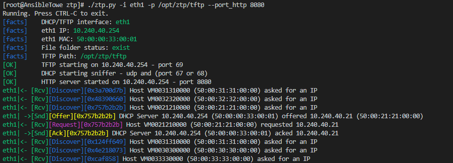
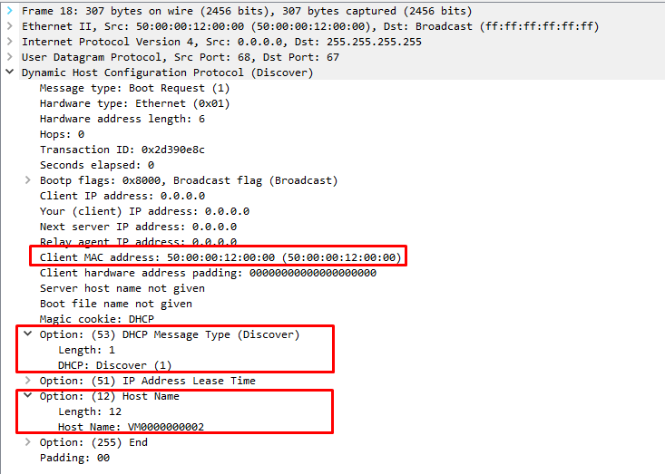

# Zero touch provisioning (ZTP) (include DHCP/TFTP/HTTP)<br>
Python3 script which using YAML file as host config to offer DHCP/IP for device.<br>
System sniff DHCP packets and answer using own build DHCP responses (based on scapy library)<br>
Built-in TFTP/HTTP servers allow host download config/firmware which was pointed in dhcp option.<br>
<br>
<i>No more installing Isc/Kea DHCP and configuring DHCP scopes/TFTP/HTTP... </i> 

## Syntax:
```console
[root@server ztp]# ./ztp.py -h
usage: ztp.py [-h] [-i INTERFACE] [-l LIMIT] [-p PATH] [--port_tftp PORT_TFTP]
              [--port_http PORT_HTTP] [-d PCAP]

optional arguments:
  -h, --help            show this help message and exit
  -i INTERFACE, --interface INTERFACE
                        Interface to service requests
  -p PATH, --path PATH  TFTP folder path. Set `None` to disable TFTP
  --port_tftp PORT_TFTP
                        TFTP port
  --port_http PORT_HTTP
                        HTTP port
  -d PCAP, --pcap PCAP  collect PCAP file name for debug
```

## Memory consumption:
```console
[root@server ztp]# pmap 3068 | grep total
 total           410900K
```

## Example:


### Config Yaml file example:
```yaml
VM0021210000:
  mac: 50:00:21:21:00:00
  hostname: Spine-21
  domain: juniper.lab
  ip: 10.240.40.21
  subnet_mask: 255.255.252.0
  router: 10.240.40.1
  name_server: 8.8.8.8       // (only SINGLE server supported)
  lease_time: 60
  tftp_server_name: 10.240.40.254
  boot-file-name: juniper.config
  tftp_server_address: 10.240.40.254
  vendor_specific: 0:junos.tgz,1:VM0021210000/juniper.sh,3:http
```
<br>
Config needs to be store in tftp folder in single / or multiple yaml files.<br>
Configs are checked/read everytime when new dhcp Discovery pacet would be capture.<br> This consuming some resorces (utlize disk) but allow you 'in fly' modyfie config without restarting ztp instance.<br>
YAML Config format:<br>

```yaml
<hostname/name>:
  mac: <mac - allow format with seperators like .:->
  <parameter>: <value>
```
In some cases new unboxed device report as <b>hostname</b> their serial number so in this situation, if script discovery that hostname inside Discovery message match this <i><hostname/name></i> - it will use this config section to send Offer.<br>
  


If <b>hostname/name</b>  will not be found in config files - it will check in 2nd step - <b><i>mac</i></b> match - for DHCP request in all configs.<br><br>
<b>parameters</b> are related to scapy dhcp layer lib which can be found under this [Link](https://github.com/secdev/scapy/blob/master/scapy/layers/dhcp.py) -> DHCPOptions<br>
Please note that parameters <b>tftp_server_name</b> (option 66) and <b>tftp_server_address</b> (option 150) are missing in scapy layer lib so it needs to be added manually:<br>
  
```bash
sed -i 's/    67: StrField/    66: "tftp_server_name",\n    67: StrField/g' /usr/local/lib/python3.6/site-packages/scapy/layers/dhcp.py
sed -i 's/    255: "end"/    150: IPField("tftp_server_address", "0.0.0.0"),\n    255: "end"/g' /usr/local/lib/python3.6/site-packages/scapy/layers/dhcp.py
```
Scapy issie [2747](https://github.com/secdev/scapy/issues/2747)


# [Docker](https://hub.docker.com/r/nchekwa/python_ztp)
Please remember that this docker need to be exposed to net=host as we need to get access to broadcast packages (scapy promisc mode). Use *IFACE* env on which interface docker should be listening.<br>

## Download docker image:
```bash
[user@localhost ~]# docker pull nchekwa/python_ztp
```

## Run in interactive mode:
```bash
[user@localhost ~]# docker run --name ztp --net=host -e IFACE="eth1" -v /tftp:/opt/ztp/tftp --rm -ti nchekwa/python_ztp
```

## Docker registration:
```bash
[user@localhost ~]# docker create \
  --name=ztp \
  --net=host \
  -e IFACE="eth1" \
  -v /tftp:/opt/ztp/tftp \
  --restart unless-stopped \
  nchekwa/python_ztp:latest

[user@localhost ~]# docker ps -a
CONTAINER ID        IMAGE                       COMMAND                   CREATED              STATUS              PORTS               NAMES
22cf97689207        nchekwa/python_ztp:latest   "/bin/sh -c '\"python…"   About a minute ago   Created                                 ztp

[user@localhost ~]# docker start ztp
ztp
[user@localhost ~]#  docker logs -f --tail 10 ztp
Running. Press CTRL-C to exit.
[facts]    DHCP/TFTP interface: eth1
[facts]    eth1 IP: 10.240.40.254
[facts]    eth1 MAC: 50:00:00:33:00:01
[facts]    File folder status: exist
[facts]    File Path: /opt/ztp/tftp
[OK]       TFTP starting on 10.240.40.254 - port 69
[Warning]  HTTP 10.240.40.254:80 port in use
[OK]       DHCP starting sniffer eth1 - udp and (port 67 or 68)
eth1|<- [Rcv][Discover][0x61ec0f9e] Host VM0033330000 (50:00:33:33:00:00) asked for an IP
eth1|<- [Rcv][Discover][0x7c78d728] Host VM0033330000 (50:00:33:33:00:00) asked for an IP
```

## Docker Composer:

### Install:
```bash
curl -L "https://github.com/docker/compose/releases/download/1.26.2/docker-compose-$(uname -s)-$(uname -m)" -o /usr/local/bin/docker-compose
chmod +x /usr/local/bin/docker-compose

docker-compose --version
docker-compose version 1.26.2, build eefe0d31
```

### Run:
#### **`docker-compose.yaml`**
```yaml
---
version: "3"
services:
  python_ztp:
    image: nchekwa/python_ztp
    container_name: ztp
    network_mode: host
    environment:
      - IFACE=eth1
    volumes:
      - /tftp:/opt/ztp/tftp
    restart: unless-stopped
```

```bash
[user@localhost ~]# docker-compose -f docker-compose.yaml up -d
[user@localhost ~]# docker-compose -f docker-compose.yaml down
```


